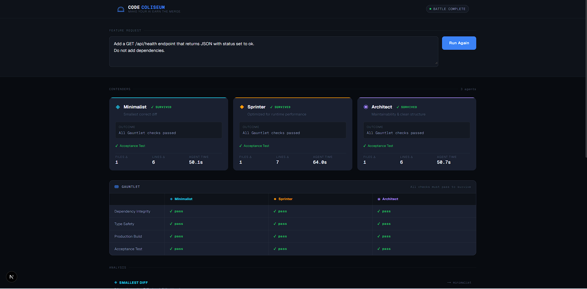
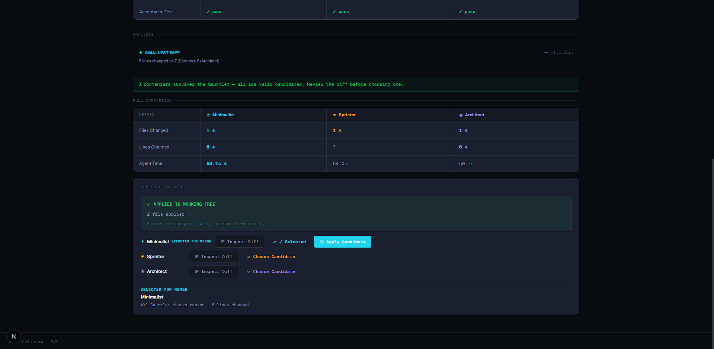

# 🏟️ Code Coliseum

### Make your AI earn the merge.

**Code Coliseum** turns AI coding into a competition.

Instead of asking one AI agent to implement a feature and trusting the first result, Code Coliseum sends the same feature request to **three isolated IBM Bob agents** with different engineering strategies.

Each contender builds its own implementation inside an isolated Git worktree.

Their implementations are then tested through a deterministic **Gauntlet**.

Only implementations that pass every mandatory check survive.

The developer can inspect the actual Git diff, compare evidence, choose a candidate, and apply that exact implementation to the main working tree.

> **AI proposes. Evidence proves. The developer decides what earns the merge.**

---

## 🎬 Demo

### Three agents enter the arena



*Three IBM Bob contenders independently implement the same feature and survive only after passing every mandatory Gauntlet check.*

### The developer decides what earns the merge



*After reviewing real Git evidence, the developer selects a surviving contender and applies that exact implementation to the main working tree.*

---

## 🎯 The Problem

AI coding agents are increasingly capable of producing working code.

But one major problem remains:

> **How do you know which implementation to trust?**

A single AI agent can produce code that appears correct while still introducing:

- build failures
- type errors
- unexpected dependency changes
- unnecessary code
- overly large diffs
- poor maintainability
- incorrect runtime behavior

Traditional AI coding often looks like this:

```text
Prompt
  ↓
AI generates code
  ↓
Developer accepts it
```

Code Coliseum changes that workflow into:

```text
Feature Request
      ↓
3 Competing IBM Bob Agents
      ↓
Isolated Git Worktrees
      ↓
Deterministic Gauntlet
      ↓
Evidence + Real Git Diffs
      ↓
Developer Chooses
      ↓
Apply Candidate
```

The goal is not to trust AI less.

The goal is to make AI-generated code **prove itself before it reaches the developer's working tree**.

---

# ⚔️ The Contenders

Every battle launches three IBM Bob coding agents.

Each receives the same feature request but follows a different engineering strategy.

## 💎 Minimalist

**Goal:** produce the smallest correct implementation.

Minimalist optimizes for:

- fewer files changed
- fewer lines changed
- minimal implementation surface
- direct solutions
- low unnecessary complexity

Example mindset:

> "What is the smallest change that correctly satisfies the request?"

---

## 🔶 Sprinter

**Goal:** optimize the implementation for runtime performance.

Sprinter focuses on:

- efficient execution paths
- avoiding unnecessary runtime work
- direct data handling
- implementation efficiency

Example mindset:

> "How can this feature execute with as little runtime overhead as practical?"

---

## 🟣 Architect

**Goal:** produce a maintainable and well-structured implementation.

Architect focuses on:

- readability
- clear structure
- maintainability
- separation of concerns
- understandable code

Example mindset:

> "How should this feature be implemented so another developer can maintain it easily?"

---

# 🧪 The Gauntlet

Generating code is not enough.

After the IBM Bob agents finish implementing their solutions, every contender must pass the same deterministic validation pipeline.

All checks are mandatory.

| Check | Description |
|---|---|
| **Dependency Integrity** | Ensures the contender did not unexpectedly modify project dependencies |
| **Type Safety** | Runs Next.js type generation and TypeScript validation |
| **Production Build** | Requires a successful production build |
| **Acceptance Test** | Runs the built application and verifies the required runtime behavior |

A contender that fails a mandatory check is:

```text
ELIMINATED
```

A contender that passes every mandatory check:

```text
SURVIVES
```

Metrics such as files changed, lines changed, and agent execution time are treated as **evidence**, not automatic elimination criteria.

The developer remains responsible for the final decision.

---

# 🌳 Real Git Isolation

Every battle begins from the same Git base commit.

Code Coliseum creates three isolated Git worktrees:

```text
Main Repository
      │
      ├── Minimalist Worktree
      │
      ├── Sprinter Worktree
      │
      └── Architect Worktree
```

Each IBM Bob agent operates only inside its assigned workspace.

This means:

- contenders cannot modify the main working tree
- contenders cannot see each other's implementation
- every contender starts from the same codebase state
- implementation comparisons remain fair

A typical battle workspace looks like:

```text
.code-coliseum-worktrees/
└── <battle-id>/
    ├── minimalist/
    ├── sprinter/
    └── architect/
```

---

# 🤖 Parallel IBM Bob Execution

After the workspaces are prepared, Code Coliseum launches the three IBM Bob agents concurrently.

```text
                      ┌─────────────┐
                      │ Minimalist  │
                      └──────┬──────┘
                             │
Feature Request ─────────────┼─────────────→ Gauntlet
                             │
                      ┌──────┴──────┐
                      │  Sprinter   │
                      └──────┬──────┘
                             │
                      ┌──────┴──────┐
                      │  Architect  │
                      └─────────────┘
```

Code Coliseum uses **IBM Bob Shell** as the real coding-agent runtime.

The feature request is passed to Bob through `stdin`, rather than interpolated directly into a shell command.

This keeps user-provided request text separate from command execution.

---

# 🔍 Inspect the Actual Code

Metrics alone are not enough.

Two implementations can both pass every test while making very different engineering decisions.

That is why Code Coliseum allows the developer to inspect the **real Git patch** created by every surviving contender.

Each survivor exposes:

```text
Inspect Diff
```

The diff viewer displays:

- changed file names
- file count
- tracked modifications
- deleted files
- newly created files
- unified Git patch output

Example:

```diff
diff --git a/src/app/api/health/route.ts b/src/app/api/health/route.ts
new file mode 100644
--- /dev/null
+++ b/src/app/api/health/route.ts
@@ -0,0 +1,6 @@
+import { NextResponse } from "next/server";
+
+export function GET() {
+  return NextResponse.json({ status: "ok" });
+}
```

Code Coliseum includes untracked files as real new-file diffs as well.

This matters because AI coding agents frequently create new files that are not visible through a plain:

```bash
git diff HEAD
```

Code Coliseum explicitly includes those files when presenting contender evidence.

---

# 📊 Evidence-Based Comparison

After the Gauntlet completes, Code Coliseum compares the surviving contenders using real implementation evidence.

Current comparison data includes:

| Metric | Source |
|---|---|
| Files Changed | Git evidence |
| Lines Added | Git evidence |
| Lines Deleted | Git evidence |
| Total Lines Changed | Derived Git evidence |
| Agent Time | IBM Bob execution timing |
| Gauntlet Status | Deterministic validation |

Example battle:

```text
              Minimalist    Sprinter    Architect

Gauntlet       SURVIVED      SURVIVED    SURVIVED
Files Changed  1             1           1
Lines Changed  6             7           6
Agent Time     50.1s         64.0s       50.7s
```

Code Coliseum may surface observations such as:

```text
SMALLEST DIFF → Minimalist
```

But metrics do not automatically choose the final candidate.

---

# 🧑‍💻 Developer-Controlled Selection

Code Coliseum intentionally does **not** automatically declare a winner.

Several implementations may be valid.

The developer reviews the evidence and decides which trade-off best fits the project.

Example:

```text
Minimalist
[ Inspect Diff ] [ ✓ Selected ]

Sprinter
[ Inspect Diff ] [ Choose Candidate ]

Architect
[ Inspect Diff ] [ Choose Candidate ]
```

Only one contender can be selected at a time.

Selecting a different survivor replaces the previous selection.

The selected contender becomes:

```text
SELECTED FOR MERGE
```

The important distinction is:

> **Code Coliseum proves which implementations survive.  
> The developer decides which implementation should move forward.**

---

# 🚀 Apply Candidate

After choosing a survivor, the developer can apply that exact implementation to the main working tree.

Code Coliseum performs several safety checks first.

Before applying a candidate, it verifies that:

- the selected contender exists
- the selected contender survived the Gauntlet
- the main working tree is clean
- the main repository is still on the same commit the battle started from

If the main branch changed after the battle started, Code Coliseum refuses to apply the candidate.

Example safety message:

```text
Main branch changed since this battle started.
Start a new battle before applying.
```

This prevents stale implementations from silently overwriting newer developer work.

After a successful apply:

```text
APPLIED TO WORKING TREE

1 file applied

Review the changes locally and commit when ready.
```

Code Coliseum deliberately does **not**:

```text
git add
git commit
git push
```

The final Git commit remains completely developer-controlled.

---

# 🛡️ Safety Principles

Code Coliseum is designed around developer control.

The current MVP follows several safety rules.

### No automatic commits

Applied contender code remains as normal uncommitted working-tree changes.

### No silent overwrite of developer work

If the main working tree is already dirty, Apply Candidate returns a conflict instead of modifying files.

### Stale battle protection

The main repository HEAD must still match the battle's base commit.

### Server-side worktree resolution

The browser never provides arbitrary filesystem paths.

The backend resolves:

```text
battleId
   ↓
stored Battle
   ↓
stored Contender
   ↓
stored worktreePath
```

### No shell interpolation of feature requests

Feature-request text is sent to IBM Bob through `stdin`.

### Isolated agent environments

Each contender runs in its own Git worktree.

---

# 🧠 Example Battle

Feature request:

```text
Add a GET /api/health endpoint that returns JSON with status set to ok.
Do not add dependencies.
```

Three Bob agents independently implemented the feature.

All three passed:

```text
✓ Dependency Integrity
✓ Type Safety
✓ Production Build
✓ Acceptance Test
```

Example evidence:

```text
Minimalist
Files Changed: 1
Lines Changed: 6

Sprinter
Files Changed: 1
Lines Changed: 7

Architect
Files Changed: 1
Lines Changed: 6
```

The developer then inspected each implementation.

A Minimalist implementation could look like:

```ts
import { NextResponse } from "next/server";

export function GET() {
  return NextResponse.json({ status: "ok" });
}
```

After reviewing all contenders, the developer selected Minimalist and applied the implementation.

The exact contender code then appeared in the main working tree as an uncommitted change.

---

# 🏗️ Architecture

```text
                           CODE COLISEUM

                         Feature Request
                               │
                               ▼
                   ┌──────────────────────┐
                   │ Battle Orchestrator  │
                   └──────────┬───────────┘
                              │
                              ▼
                         Base Git Commit
                              │
                ┌─────────────┼─────────────┐
                │             │             │
                ▼             ▼             ▼
          Minimalist      Sprinter      Architect
           Worktree       Worktree       Worktree
                │             │             │
                ▼             ▼             ▼
           IBM Bob        IBM Bob        IBM Bob
                │             │             │
                └─────────────┼─────────────┘
                              │
                              ▼
                     ┌────────────────┐
                     │   Gauntlet     │
                     ├────────────────┤
                     │ Dependency     │
                     │ Type Safety    │
                     │ Build          │
                     │ Acceptance     │
                     └───────┬────────┘
                             │
                             ▼
                    Evidence + Metrics
                             │
                             ▼
                       Inspect Diff
                             │
                             ▼
                     Choose Candidate
                             │
                             ▼
                      Apply Candidate
                             │
                             ▼
                  Developer Working Tree
                             │
                             ▼
                   Developer Git Commit
```

---

# 🔄 Battle Lifecycle

A contender moves through the following lifecycle:

```text
CREATED
   ↓
PROVISIONING
   ↓
READY
   ↓
RUNNING
   ↓
COMPLETED
   ↓
GAUNTLET
   ↓
SURVIVED / ELIMINATED
```

Provisioning failures are isolated:

```text
PROVISIONING_FAILED
```

Bob execution failures are also represented explicitly.

At the battle level, the Arena reflects meaningful phases such as:

```text
READY
PREPARING ARENA
BATTLE RUNNING
JUDGING
BATTLE COMPLETE
BATTLE FAILED
```

---

# ⚙️ API Overview

The MVP currently exposes battle operations through Next.js API routes.

### Create Battle

```http
POST /api/battles
```

Example body:

```json
{
  "featureRequest": "Add a GET /api/health endpoint that returns JSON with status set to ok."
}
```

### Run Battle

```http
POST /api/battles/:battleId/run
```

Starts provisioning and Bob execution.

### Read Battle State

```http
GET /api/battles/:battleId
```

Returns live contender state, Gauntlet results, metrics, and developer selection state.

### Inspect Contender Diff

```http
GET /api/battles/:battleId/contenders/:contenderId/diff
```

Returns the real unified Git patch for a contender.

### Choose Candidate

```http
POST /api/battles/:battleId/select
```

Example:

```json
{
  "contenderId": "minimalist"
}
```

### Apply Candidate

```http
POST /api/battles/:battleId/apply
```

Applies the currently selected surviving contender to the main working tree.

No commit is created automatically.

---

# 🛠️ Tech Stack

- **IBM Bob**
- **IBM Bob Shell**
- **Next.js 16**
- **React**
- **TypeScript**
- **Node.js**
- **Git Worktrees**
- **PowerShell**
- Native Node.js filesystem APIs
- Native Node.js child-process APIs
- Native Node.js HTTP APIs

The current MVP intentionally avoids unnecessary infrastructure.

No database is required. Battle state is currently stored in memory.

---

# 💻 Running Locally

## Requirements

- Node.js
- npm
- Git
- IBM Bob Shell
- a valid `BOB_API_KEY`

## 1. Clone the repository

```bash
git clone https://github.com/RivaldiMurpia/code-coliseum.git
cd code-coliseum
```

## 2. Install dependencies

```bash
npm install
```

## 3. Configure IBM Bob

Make sure IBM Bob Shell is installed and available:

```bash
bob --version
```

### PowerShell — current terminal only

```powershell
$env:BOB_API_KEY = "YOUR_API_KEY"
```

### PowerShell — Windows user environment

```powershell
[System.Environment]::SetEnvironmentVariable(
    "BOB_API_KEY",
    "YOUR_API_KEY",
    "User"
)
```

Restart your terminal or IDE after setting a persistent environment variable.

**Do not commit API keys to the repository.**

## 4. Start Code Coliseum

```bash
npm run dev -- --port 3001
```

Open:

```text
http://localhost:3001
```

---

# ✅ Project Validation

The current project passes:

```bash
npx tsc --noEmit
npm run lint
npm run build
```

---

# ✅ Current MVP Status

The current Code Coliseum MVP supports:

```text
✓ Feature request submission
✓ Three IBM Bob contender personas
✓ Isolated Git worktrees
✓ Parallel IBM Bob execution
✓ Real execution lifecycle
✓ Dependency provisioning
✓ Deterministic Gauntlet validation
✓ Dependency integrity checks
✓ Type-safety validation
✓ Production-build validation
✓ Runtime acceptance testing
✓ Real Git metrics
✓ Tracked-file detection
✓ Untracked-file detection
✓ Unified Git diff inspection
✓ Developer-controlled candidate selection
✓ Apply selected implementation to main working tree
✓ Dirty-tree protection
✓ Stale-battle protection
✓ No automatic commit or push
```

---

# 🚧 Current MVP Limitations

- battle state is in-memory
- battles are not persisted across server restarts
- current acceptance testing is designed around the demo scenario
- worktree cleanup can be improved further
- deployment environments require filesystem and Git access
- the Arena currently targets local developer workflows

These constraints are intentional for the current prototype.

---

# 🔮 Future Direction

Potential future extensions include:

```text
Repository-aware generated acceptance tests
             ↓
Configurable contender strategies
             ↓
Persistent battle history
             ↓
Cost / token evidence
             ↓
Security scanning
             ↓
Complexity analysis
             ↓
CI integration
             ↓
Pull Request integration
             ↓
Team voting / approvals
             ↓
Remote sandbox execution
```

A future version of Code Coliseum could act as an evidence layer between autonomous coding agents and production repositories.

---

# 🏆 Built for IBM Bob Hackathon 2.0

Code Coliseum explores a different way to work with coding agents.

Instead of asking:

> **"Can an AI write this feature?"**

Code Coliseum asks:

> **"Which implementation can prove it deserves to reach the codebase?"**

The system combines:

```text
AI generation
+
isolated competition
+
deterministic validation
+
real Git evidence
+
human judgment
```

into one developer workflow.

---

# 🏟️ Code Coliseum

### Three agents enter.

### Evidence decides what survives.

### The developer decides what earns the merge.
